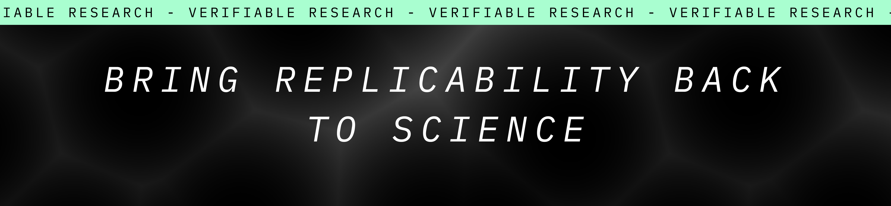
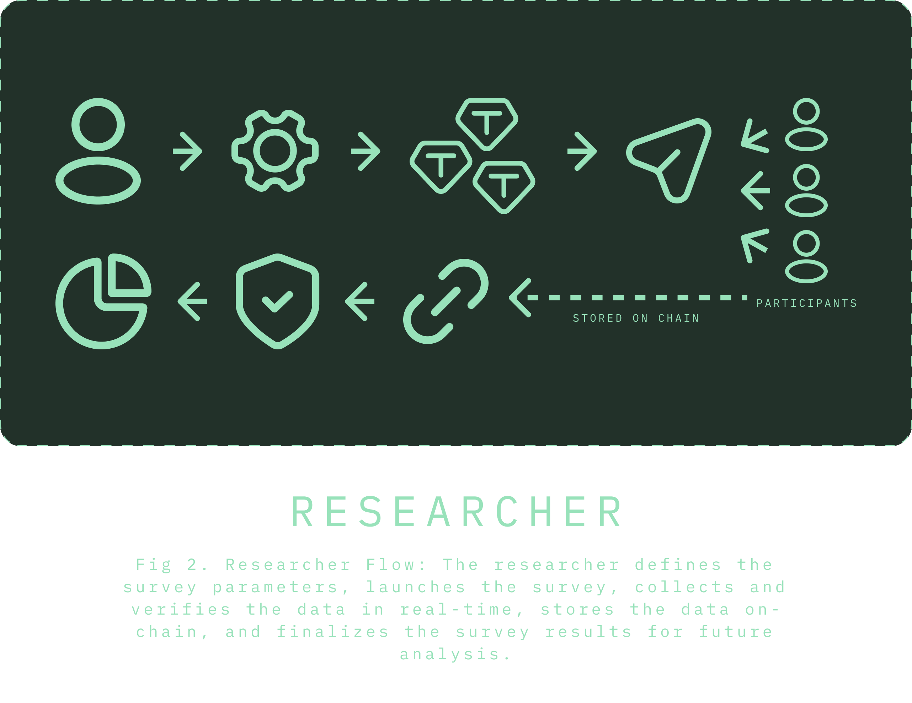
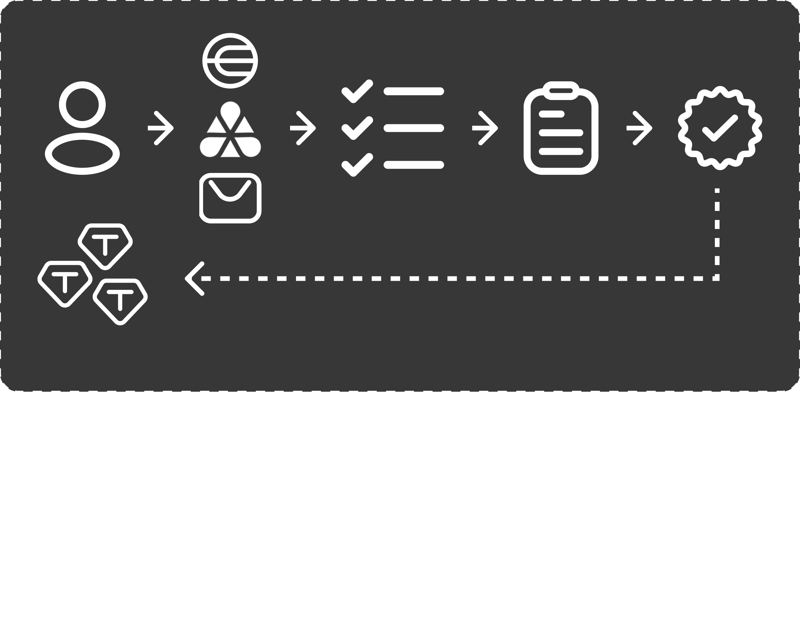

# Science... well, basically science sucks

Scientific research often faces challenges due to inconsistencies in data, making findings difficult to replicate. Researchers frequently struggle to identify participants who meet specific criteria, and online surveys are increasingly vulnerable to being overrun by bots, leading to unreliable results. This results in:

- A lack of trust in the data
- Unverifiable datasets
- The proliferation of manipulated data
- The potential for p-hacking
- Reduced replicability of scientific studies

# How can we make it suck less?

- Reward: Survey participants need to have incentives to participate in an honest way.
- Verify: Researchers need to verify that their participants are truly eligible.
- Commit: Researchers commit the data they have gathered in order to pre-register it.

# The flow

## Researcher POV
We can think of this flow as:

### Survey Setup

- Define the parameters for the survey, including whether there’s a cap on the number of participants and any participation rewards.
- Set specific restrictions for participants, such as requiring Proof of Personhood (PoP) verification and other criteria like age, gender, or prior event participation.

### Launch the Survey

- Once the survey parameters are set, launch it through the platform’s UI.
- Monitor the survey results on real time

### Data Collection & On-chain Storage and Verification

- Collect responses as participants complete the survey.
- Store each response’s data, including proof of PoP (if present) and compliance with participation criteria, on decentralized storage (Filecoin and IPFS) to guarantee immutability and transparency.
- Pre-register the data on-chain for replicability.

### Survey Completion

- Once the survey reaches the participant cap or the survey creator decides to end it, finalize the survey and generate the results.
- The results are stored on-chain, ready for future analysis and validation.

## User POV
We can think of this flow as: 

### Login and Access

- Log in to the platform using one of the available options (e.g., Worldcoin, Quark ID, email) to be available to participate in the survey.
- If you meet the required criteria set by the researcher, you gain access to a given survey.

### Survey Participation

- Complete the survey as instructed.
- If applicable, receive any promised incentives once you finish the survey.

### Data Integrity

- Your participation data, including any verification proof, is stored on-chain, ensuring that your input is valid.

### Survey Completion

- After the survey is completed or the participant cap is reached, the final results are generated and stored on-chain.
- You can be assured that the survey data is secure, verified, and contributes to trustworthy research outcomes.

# The implementation

